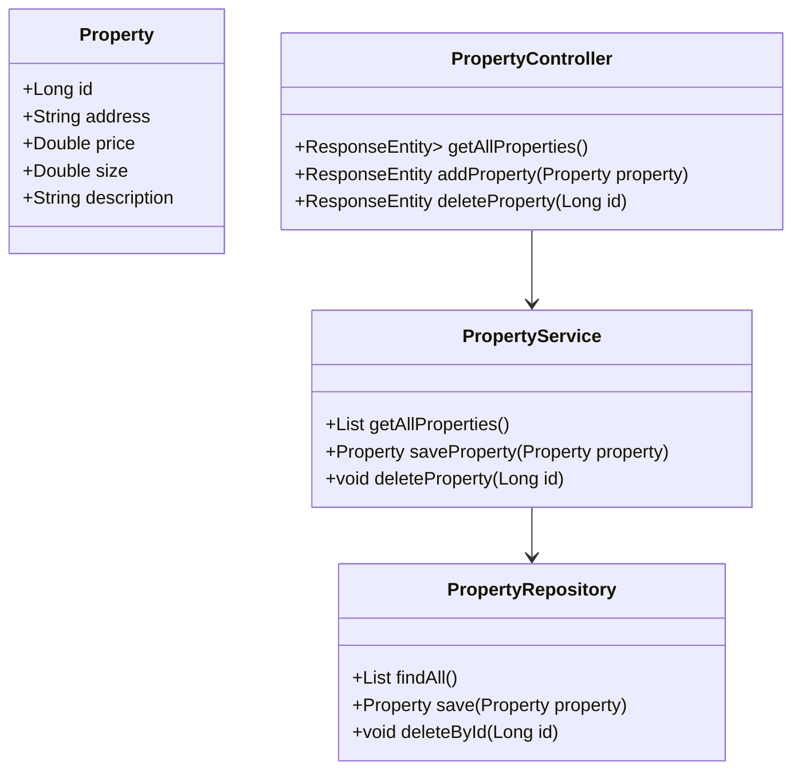

# Sistema CRUD de Propiedades

Este sistema permite la gestión de propiedades inmobiliarias, permitiendo realizar operaciones CRUD (Crear, Leer, Actualizar y Eliminar). La aplicación está construida con un **backend en Spring Boot**, un **frontend en JavaScript/HTML/CSS** (ambos desplegados en un servidor AWS) y una **base de datos MySQL** desplegada en AWS tambien.

---

## Arquitectura del Sistema

El sistema sigue una arquitectura **cliente-servidor**, separando el frontend, backend y base de datos en contenedores y servidores distintos:

1. **Frontend:** Aplicación web construida con HTML, CSS y JavaScript.
2. **Backend:** API REST en Spring Boot con JPA/Hibernate para interactuar con la base de datos.
3. **Base de Datos:** MySQL desplegado en AWS.
4. **Despliegue:** Los componentes están separados en diferentes servidores en AWS.

---

## Diseño de Clases

### Principales Clases



- **Property**: Representa una propiedad inmobiliaria.
- **PropertyRepository**: Interfaz que maneja la persistencia con JPA.
- **PropertyService**: Contiene la lógica de negocio para las propiedades.
- **PropertyController**: Exposición de la API REST para interactuar con el frontend.

---

## Instrucciones de Despliegue

### 1. Construcción y Despliegue del Backend

Ejecuta el siguiente comando en la terminal de la instancia AWS EC2:

```sh
docker --version
```

Si tu instancia EC2 usa Amazon Linux 2, ejecute:

```sh
sudo yum update -y
sudo yum install -y docker
```

Después de instalar Docker, asegurece de que se inicie automáticamente:

```sh
sudo systemctl enable docker
sudo systemctl start docker
```

Luego, ejecuta:

```sh
sudo systemctl enable docker
sudo systemctl start docker
```

Para asegurarse que el contenedor escuche el puerto correcto, se necesita tener activo la regla de seguridad con el puerto "42002" para que se ejecute correctamente, tal y como aparece en esta imagen:


Con todas las configuraciones listas simplemente ejecutar el siguiente comando en la instancia para poder ejecutar el backend ya conectado a una base de datos generado en una instancia con una ip publica:

docker run -d --name backend -p 8080:8080 jhonssosa/lab05:latest

Finalmente para probar la base de datos simplemente escribir en el navegador (Omitir microsoft edge por problemas de compatibilidad) el siguiente link el cual ejecutara el programa en cuesiton:

```sh
http://ec2-18-216-183-219.us-east-2.compute.amazonaws.com:8080/
```

### 4. Configuración en AWS

1. **Base de Datos:** Implementa una instancia de MySQL en AWS RDS.
2. **Backend:** Despliega la API en un servidor EC2.

---

##  Capturas de Pantalla

### Listado de Propiedades


### Creación de Propiedad


### Edición de Propiedad


### Eliminación de Propiedad


---

